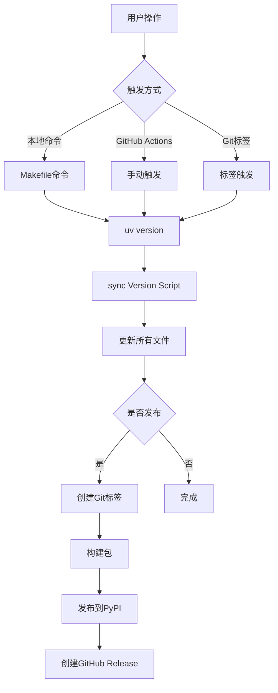

# 版本管理系统

本项目实现了完整的版本管理自动化，支持两种触发方式：本地命令行和GitHub Actions。

## 🎯 功能特性

- **单一数据源**: `pyproject.toml` 作为版本信息的唯一来源
- **自动同步**: 版本变更自动同步到所有项目文件
- **多种发布方式**: 支持本地发布和GitHub Actions自动化发布
- **语义化版本**: 完全遵循 `MAJOR.MINOR.PATCH` 规范

## 📦 核心组件

### 1. 版本同步脚本 (`scripts/sync_version.py`)
从 `pyproject.toml` 读取版本信息，同步到：
- `src/genome_mcp/__init__.py`
- `src/genome_mcp/main.py`

### 2. GitHub Actions工作流 (`.github/workflows/publish.yml`)
支持两种触发方式：
- **标签触发**: 传统方式，推送标签后自动发布
- **手动触发**: 自动版本管理 + 可选发布

### 3. Makefile集成
提供便捷的本地命令行接口

## 🚀 使用方法

### 本地版本管理

```bash
# 查看当前版本
make version

# 升级修订版本 (0.2.4 → 0.2.5)
make version-patch

# 升级次版本 (0.2.4 → 0.3.0)
make version-minor

# 升级主版本 (0.2.4 → 1.0.0)
make version-major

# 仅同步版本信息（不升级）
make sync-version

# 测试版本管理流程
make test-release

# 本地发布（创建标签并推送）
make release-patch
```

### GitHub Actions自动化发布

#### 方法1: 手动触发（推荐）

1. 访问 GitHub → Actions → "Version Management and Release"
2. 点击 "Run workflow"
3. 选择参数：
   - **bump_type**: 版本升级类型 (patch/minor/major)
   - **auto_release**: 是否发布到PyPI (true/false)
4. 点击 "Run workflow"

**优势**:
- 一键完成版本管理和发布
- 自动创建Git标签
- 自动生成Release说明
- 可选择是否发布到PyPI

#### 方法2: 传统标签触发

```bash
# 本地操作
uv version --bump patch
git add -A
git commit -m "chore: 版本升级"
git tag v0.2.5
git push origin v0.2.5
```

**适用场景**:
- 需要精确控制发布时机
- 紧急修复版本
- 预发布版本管理

## 📋 版本信息位置

项目中的版本信息统一管理：

```
pyproject.toml:7           version = "0.2.4"          ⭐ 权威源
src/genome_mcp/__init__.py __version__ = "0.2.4"      自动同步
src/genome_mcp/main.py:18   FastMCP(version="0.2.4")     自动同步
src/genome_mcp/main.py:52   "Genome MCP v0.2.4"          自动同步
```

## 🔧 技术实现

### 工作流程



### 核心逻辑

1. **版本管理**: 使用 `uv version` 命令
2. **文件同步**: 正则表达式替换版本字符串
3. **Git操作**: 自动创建标签和推送
4. **CI/CD集成**: GitHub Actions自动化流程

## 🛠️ 开发指南

### 修改版本信息

**唯一需要手动修改的地方**:
```toml
# pyproject.toml
[project]
version = "0.2.4"  # ← 这里是唯一的手动修改点
```

### 添加新的同步目标

如果需要在更多文件中同步版本，修改 `scripts/sync_version.py`:

```python
def update_new_file(version):
    """更新新文件中的版本"""
    file_path = Path('path/to/new_file.py')
    content = file_path.read_text()
    content = re.sub(r'version_pattern', f'version_string_{version}', content)
    file_path.write_text(content)
```

### 自定义发布流程

修改 `.github/workflows/publish.yml` 中的发布逻辑：

```yaml
- name: Custom Release Step
  if: steps.trigger.outputs.source == 'manual'
  run: |
    # 添加自定义逻辑
```

## 📈 最佳实践

### 日常开发
1. 使用 `make version-patch` 进行小版本升级
2. 新功能开发时使用 `make version-minor`
3. 重大变更时使用 `make version-major`

### 发布流程
1. **常规发布**: 使用GitHub Actions手动触发
2. **紧急修复**: 使用本地命令 + 标签触发
3. **预发布**: 设置 `auto_release=false` 测试版本管理

### 版本命名规范
- **正式版本**: `v0.2.4`
- **预发布版本**: `v0.3.0-alpha.1`
- **修复版本**: `v0.2.5-hotfix`

## 🔍 故障排除

### 常见问题

**Q: 版本同步失败**
```bash
# 检查pyproject.toml格式
python scripts/sync_version.py

# 检查权限
ls -la src/genome_mcp/__init__.py
```

**Q: GitHub Actions发布失败**
- 检查 `PYPI_API_TOKEN` 密钥配置
- 确认仓库权限设置
- 查看Actions日志

**Q: 本地发布失败**
```bash
# 检查Git配置
git config --list

# 检查远程仓库
git remote -v
```

### 回滚版本

```bash
# 删除错误标签
git tag -d v0.2.5
git push origin :refs/tags/v0.2.5

# 回退版本
uv version 0.2.4
make sync-version
```

## 📞 支持

如有问题，请：
1. 查看 [GitHub Issues](https://github.com/gqy20/genome-mcp/issues)
2. 检查 [Actions日志](https://github.com/gqy20/genome-mcp/actions)
3. 参考 [uv文档](https://docs.astral.sh/uv/)